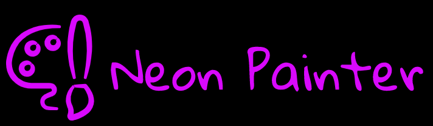

# Neon Painter 

## What is it?
Neon Painter is A 3D Painting VR application where user stands on top of a lone planet in randomly generated space scene. Combined with gorgeous graphics and intuitive painting system, user will have an immersive and expressive VR experience. 

## Motivation
 The theme is inspired by the concept of "overview effect," an euphoria astronauts often experience during flight. The visual of this game is inspired by Cyberpunk 2077. I intend to use this game as a way to capture that shift in awareness and use painting as a way for user to express themselves, almost as a meditative experience. 
 
 ## Gameplay
 